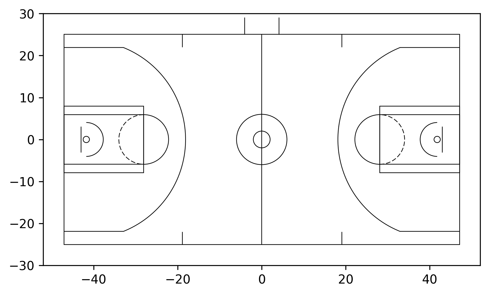
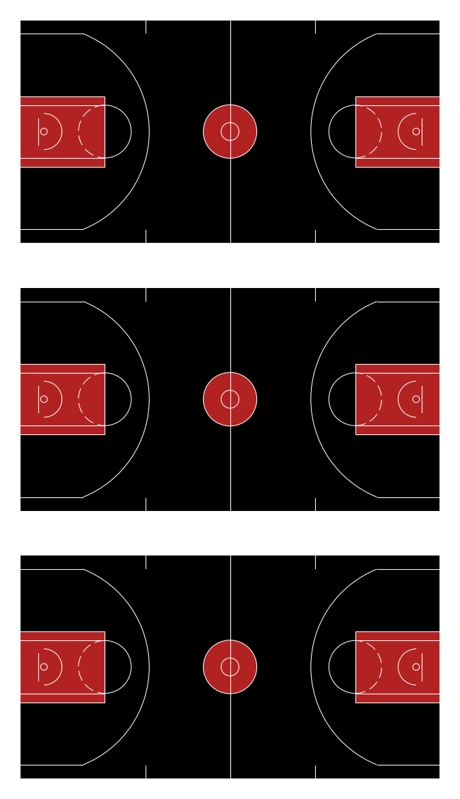
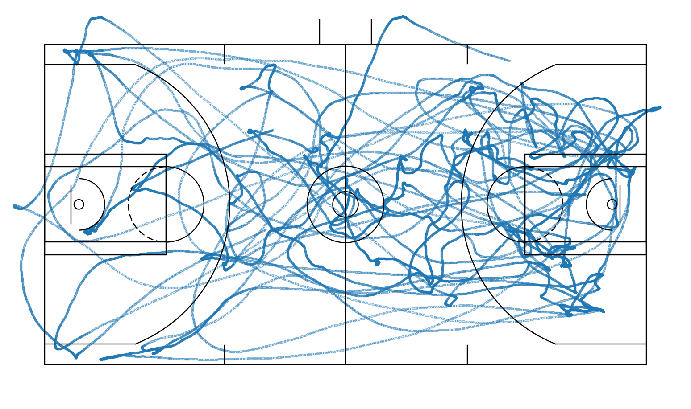
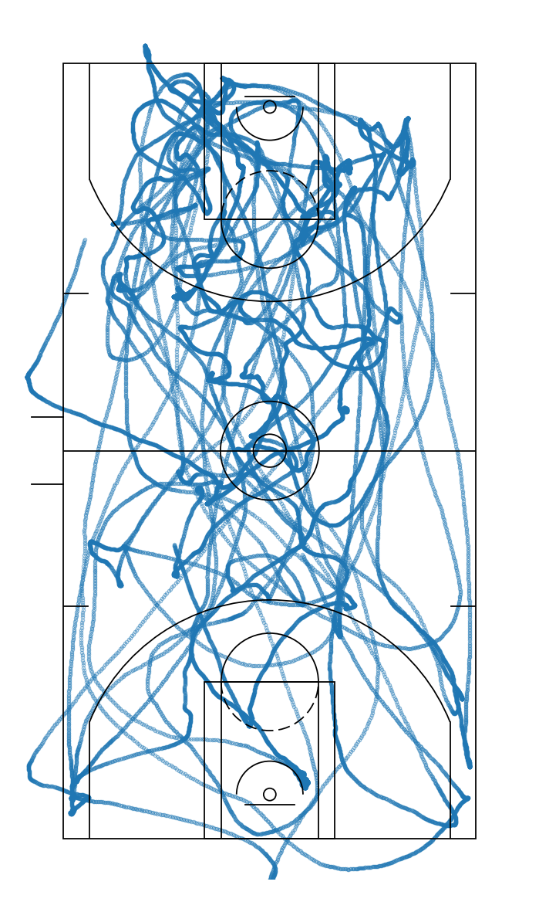
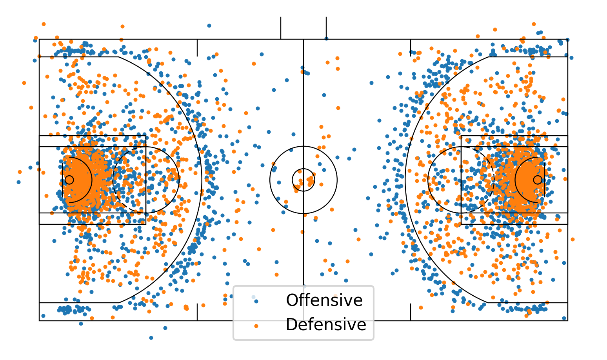
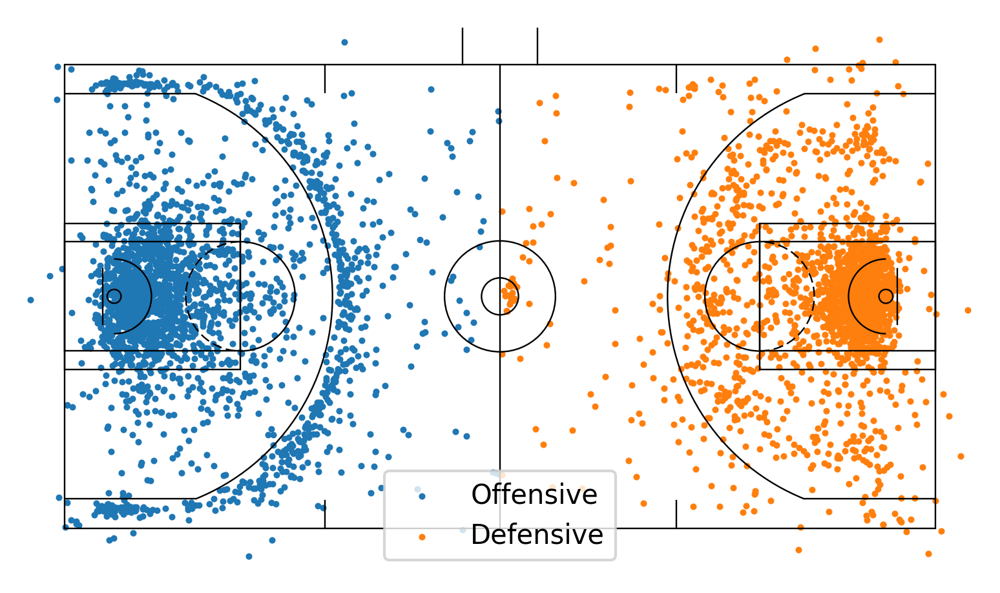
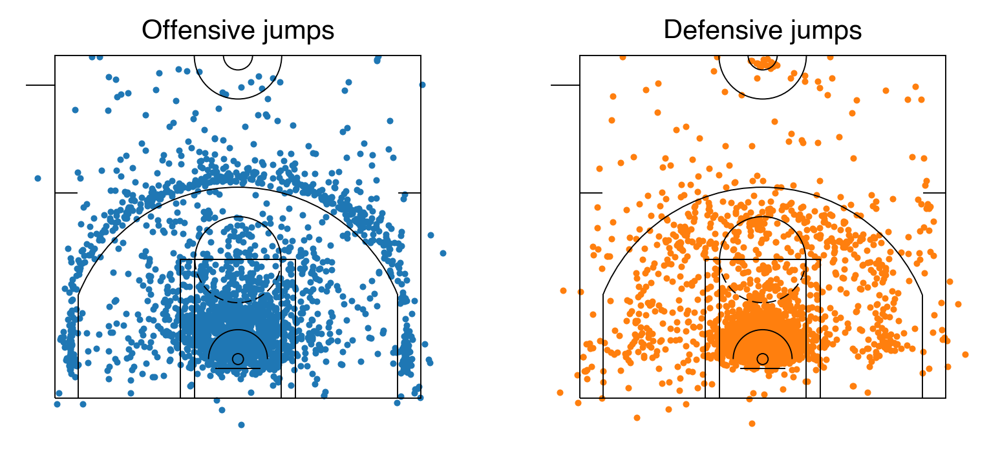
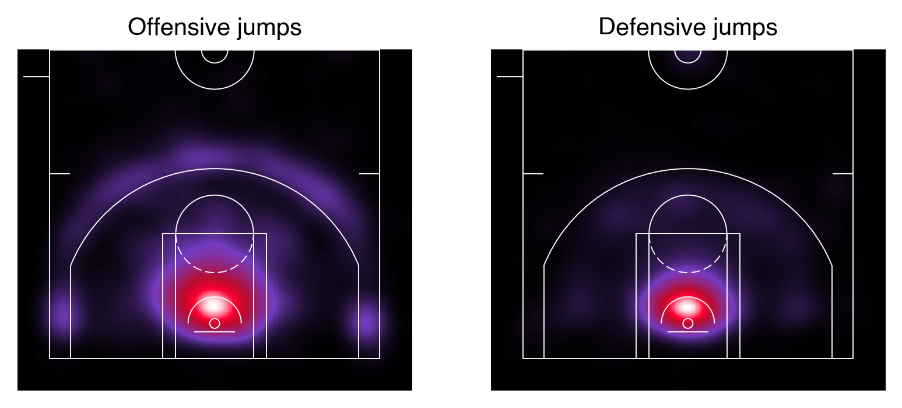

# mplbasketball
Basketball plotting library for use with matplotlib. Currently a `Court()` object can be defined with an NBA or WNBA court. 

# Installation
Install using 
```
pip3 install git+https://{TOKEN}@github.com/mlsedigital/mplbasketball.git 
```

# Structure

The packace stands on two central pillars (Python classes): `Court` and `SpatialData`. 

## The `Court` class
The `Court` class comprises of the dimensions of the basketball court under consideration. When being defined, it takes in a `court_type`, which can currently be `"nba"` or `"wnba"`. Court attributes are provided in `mplbasketball/court_params.py`. The `Court` class has a method `draw()`, which will draw the court in any desired `orientation`:
1. `"h"`: horizontal (default) 
2. `"v"`: vertical
3. `"hl"`: horizontal, only left side
4. `"hr"`: horizontal, only right side
5. `"vu"`: vertical, only up side
6. `"vd"`: vertical, only down side

Note that "up" and "down" defined above refer to where the basket is situated. 

Below is a basic example, where we define an NBA court, and plot it in the `"h"` orientation

```python
from matplotlib.court import Court

nba_court = Court(court_type="nba")

fig, ax = nba_court.draw(orientation="h", showaxis=True)
```
<p align="center">
  
</p>


If you want to get a little fancy, you can create a grid, and also color in the court.

```
fig, ax = nba_court.draw(ncols=3, orientation="h", pad=4., court_color="black", paint_color="firebrick", line_color="white")
```
<p align="center">
  
</p>

In the above, `ax` can now be subscripted to plot different things on each of the courts, just like a `plt.subplots()` call. See below for examples.

## The `SpatialData` superclass and `Provider` subclasses

Now that we have a court, we want to plot things on it. Basketball data from data provides is provided in the horizontal (`"h"`) orientation, and usually has the origin situated either at center court, or on the top-left. `mplbasketball` courts are drawn by assuming that the origin is at center court, so we need a framework to be able to accept data from different providers, and transform them seamlessly to enable plotting in the package. 

Enter the `SpatialData` class. Essentially, it can be initialized using the raw `x` and `y` data, along with the `Court` object on which they will be plotted. At a practical level, each provider will have an associated subclass of `SpatialData`, where a unique `standardize()` function will bring it to the correct coordinates for plotting using `mplbasketball`. 

As an example, consider Hawkeye data. It is given to us with the following attributes:
1. It is in a left-handed coordinate system.
2. It can have an origin either at the center or at the top left. 

We thus have a `Hawkeye` subclass of `SpatialData`, which when initialized, takes the above points into account and transforms the `x` and `y` data into `mplbasketball` coordinates. 

```
from mplbasketball.court import Court
from mplbasketball.dataclass import Hawkeye

wnba_court = Court(court_type="wnba")
x = # random x data
y = # random y data
print(f"x={x[:10]}, y={y[:10]}")
sd = Hawkeye(x, y, wnba_court, origin="top-left")
print(f"x={sd.x[:10]}, y={sd.y[:10]}")
```
### Transforming data
The true power of using the `SpatialData` class is seen when plotting in different orientations. Say we have some Hawkeye tracking data, with the origin at the top-left. 
```
import xarray as xr
from mplbasketball.court import Court
from mplbasketball.dataclass import Hawkeye

data = xr.load_dataset("/path/to/data.nc)
player_id = data.coords["player_id"].values[3]
joint = "mid_hip"

# Load some x, y data
x = data_new_coords["player_position"].sel(player_id=player_id, joint=joint).values[:, 0]
y = data_new_coords["player_position"].sel(player_id=player_id, joint=joint).values[:, 1]

# Set up a court
nba_court = Court(court_type="nba")

# Load x, y into a Hawkeye object
sd = dc.Hawkeye(x, y, nba_court, lhcs=True, origin="top-left")

fig, ax = nba_court.draw()

ax.scatter(x=sd.x, y=sd.y, s=0.1, alpha=0.5, zorder=0)
```
<p align="center">
  
</p>

What if we now wanted to plot this on a vertical court? Easy!

```
# Draw a new vertical court 
fig, ax = nba_court.draw(orientation="v")
x_v, y_v = sd.transform("v")
ax.scatter(x=x_v, y=y_v)
```
<p align="center">
  
</p>

### Normalizing to a side of the court
Say we had data on both sides of a court, and wanted to normalize it to only take place on one side. Here is an example: I have a list of jumps from the season, stored in a `.pkl` file. Jumps are classed into offensive and defensive jumps:
```
import pandas as pd
import matplotlib.pyplot as plt
from mplbasketball.court import Court

jumps = pd.read_pickle("jumps.pkl")

# Get x, y components of offensive and defensive jumps
off_jumps_x = jumps.loc[jumps["jump_type"]=="Offensive", "jump_x_position"]
off_jumps_y = jumps.loc[jumps["jump_type"]=="Offensive", "jump_y_position"]
off_jumps_x, off_jumps_y = normalize_to_left_side_array(off_jumps_x, off_jumps_y)

def_jumps_x = jumps.loc[jumps["jump_type"]=="Defensive", "jump_x_position"]
def_jumps_y = jumps.loc[jumps["jump_type"]=="Defensive", "jump_y_position"]
def_jumps_x, def_jumps_y = normalize_to_left_side_array(def_jumps_x, def_jumps_y)

```
Plotting them on a full horizontal court is easy:

```
nba_court = Court(court_type="nba)

sd_off = Hawkeye(off_jumps_x, off_jumps_y, nba_court)
sd_def = Hawkeye(def_jumps_x, def_jumps_y, nba_court)

fig, ax = nba_court.draw()

ax.scatter(x=sd_off.x, y=sd_off.y, s=2, zorder=0, label="Offensive")
ax.scatter(x=sd_def.x, y=sd_def.y, s=2, zorder=0, label="Defensive")
plt.legend()
```
<p align="center">
  
</p>

That's no good.. all the jumps are all over the place. Say I wanted to send all the offensive jumps to the left and all the defensive ones to the right. e.a.s.y.
```
x_off_l, y_off_l = sd_off.transform("hl")  # transform to "horizontal-left side
x_def_r, y_def_r = sd_def.transform("hr")  # transform to "horizontal-right side

fig, ax = nba_court.draw()

ax.scatter(x=x_off_l, y=y_off_l, s=2, zorder=0, label="Offensive")
ax.scatter(x=x_def_r, y=y_def_r, s=2, zorder=0, label="Defensive")
```
<p align="center">
  
</p>

We can plot the above as two half court plots, and have them be vertical:
```
x_off_d, y_off_d = sd_off.transform("vd")  # transform to "horizontal-left side
x_def_d, y_def_d = sd_def.transform("vd")  # transform to "horizontal-right side

fig, ax = nba_court.draw(ncols=2, orientation="vd")

ax[0].set_title("Offensive jumps", font="Helvetica")
ax[0].scatter(x=x_off_d, y=y_off_d, s=2, zorder=0, label="Offensive", c="tab:blue")
ax[1].set_title("Defensive jumps", font="Helvetica")
ax[1].scatter(x=x_def_d, y=y_def_d, s=2, zorder=0, label="Defensive", c="tab:orange")
```

<p align="center">
  
</p>

# Other features

## Heat maps 
Using where we left off with the jumps example, we are able to visualizze the same data as a heatmap:
```
from mplbasketball.heatmap import heatmap
# Redraw court with different line_color because heatmap is dark
fig, ax = nba_court.draw(ncols=2, orientation="vd", line_color="white")

ax[0].set_title("Offensive jumps", font="Helvetica")
heatmap(ax[0], x_off_d, y_off_d, grid_x=300, grid_y=300, sigma=10.)
ax[1].set_title("Defensive jumps", font="Helvetica")
heatmap(ax[1], x_def_d, y_def_d, grid_x=300, grid_y=300, sigma=10.)
```

<p align="center">
  
</p>

## Upcoming

1. NBA API support. 
