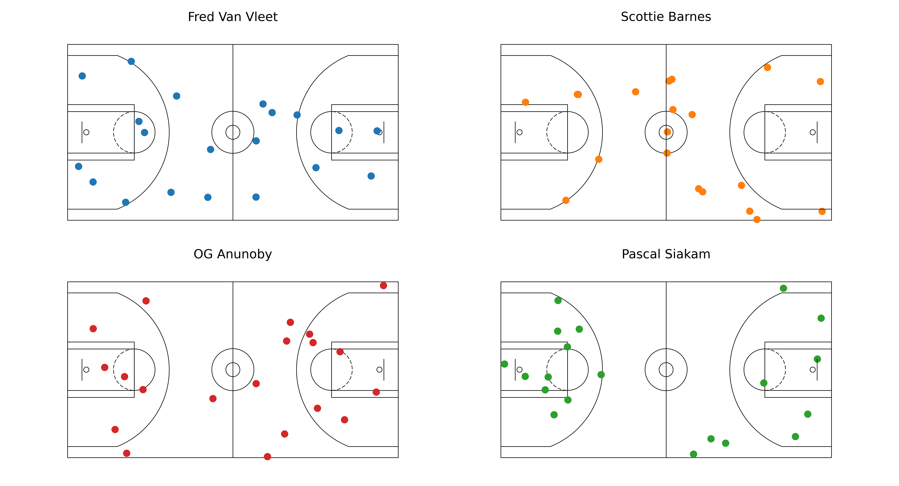

# mplbasketball
Basketball plotting library for use with matplotlib. Currently a `Court()` object can be defined with an NBA or WNBA court. 

## Installation
Install using 
```
pip3 install --force-reinstall git+https://{TOKEN}@github.com/mlsedigital/mplbasketball.git 
```

## Quick usage guide

```python
from matplotlib.court import Court

nba_court = Court(court_type="nba")

fig, ax = plt.subplots(figsize=(12, 6.5))
ax = nba_court.draw(ax)

# Assume you have some (x, y) data you want to plot
data_x = np.random.uniform(-47, 47, size=(20,))
data_y = np.random.uniform(-25, 25, size=(20,))

ax.scatter(x=data_x, y=data_y)
```

If you do not initialize a `fig, ax`, `Court.draw()` initializes one for you with dimensions `nrows x ncols`, so you will have 
```
from matplotlib.court import Court

nba_court = Court(court_type="nba")

ax = nba_court.draw(nrows=2, ncols=2)

# Assume you have some (x, y) data you want to plot
data_x = np.random.uniform(-47, 47, size=(20,))
data_y = np.random.uniform(-25, 25, size=(20,))

ax[0, 0].scatter(x=data_x, y=data_y)
# ax[0, 1].scatter = ...
# ax[1, 0].scatter = ...
# ax[1, 1].scatter = ...
```

## Package notes

The current iteration of the code only works with Hawk-Eye data. 
- The origin of the coordinate system is at center-court. This means that in-court actions all take place between `[-47, 47]` in the `x` direction, and `[-25, 25]` in the `y` direction. 

See the `examples` folder to get a sense of some examples. We can make plots with single courts, or ones like this:


## Upcoming

1. Vertical half court plots. 
2. NCAA and FIBA court dimensions.
3. NBA API support. 
4. Heat maps.